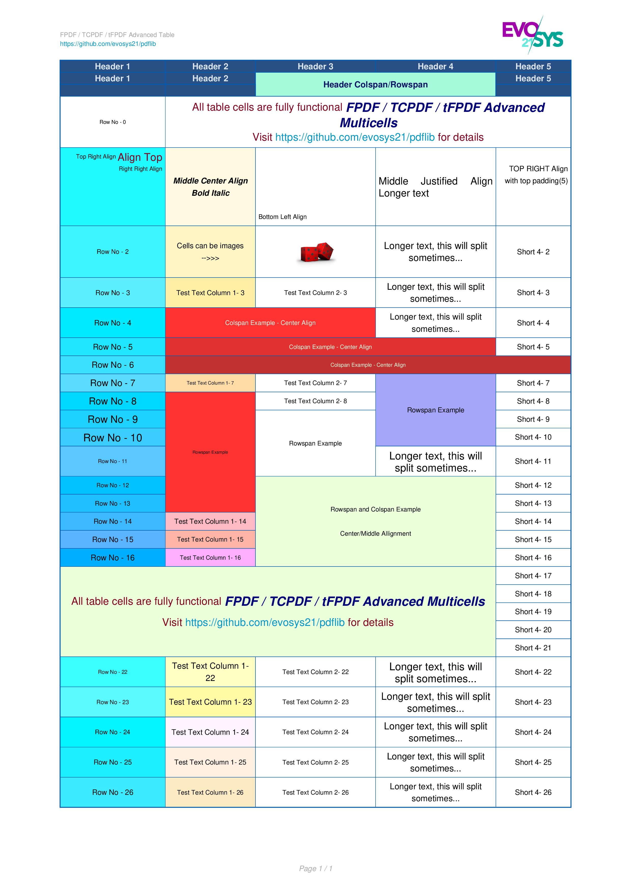

<h1>Fpdf, TCPDF, tFpdf - Advanced Multicell and Table</h1>

 

<!-- TOC -->
  * [Overview](#overview)
  * [Advanced Multicell](#advanced-multicell)
    * [Features:](#features)
    * [Examples:](#examples)
  * [Advanced table](#advanced-table)
    * [Features:](#features-1)
    * [Examples:](#examples-1)
  * [FAQ](#faq)
    * [Where do I report issues?](#where-do-i-report-issues)
  * [Contribute](#contribute)
  * [License](#license)
<!-- TOC -->

---

## Overview

`evosys21/pdflib` is a collection of PHP classes facilitating developers to create [Advanced Multicells]() and [Tables]() in [FPDF](http://www.fpdf.org), [TCPDF](https://github.com/tecnickcom/TCPDF) or
[tFPDF](http://fpdf.org/en/script/script92.php).

## Advanced Multicell

This addon class allows creation of an **Advanced Multicell for FPDF/TCPDF/tFPDF** which uses as input a TAG based formatted
string instead of a simple string. The use of tags allows to change the font, the style (bold, italic, underline),
the size, and the color of characters and many other features.

The function is pretty similar to the Multicell function in the tcpdf base class with some extended parameters.

### Features:

- Text can be aligned, centered or justified
- Different Font, Sizes, Styles, Colors can be used
- The cell block can be framed and the background painted
- Links can be used in any tag
- TAB spaces (t) can be used
- Variable Y relative positions can be used for Subscript or Superscript
- Cell padding (left, right, top, bottom)
- Controlled Tag Sizes can be used

### Examples:

|         | Multicell Example #1 - Overview                                                                                             | multicell Example #1 - Overview                                                                                               | 
|---------|-----------------------------------------------------------------------------------------------------------------------------|-------------------------------------------------------------------------------------------------------------------------------|
| Code    | [example-multicell-1-overview.php](examples/Tcpdf/example-multicell-1-overview.php)                                         | [example-multicell-6-shrinking.php](examples/Tcpdf/example-multicell-6-shrinking.php)                                         |
| Preview |  |  |
| Pdf     | [example-multicell-1-overview.pdf](examples/Tcpdf/example-multicell-1-overview.pdf)                                         | [example-multicell-1-overview.pdf](examples/Tcpdf/example-multicell-1-overview.pdf)                                           |      |

In the [examples](examples) are more examples with preview and the associated code.

## Advanced table

This addon class allows creation of an **Advanced Table for FPDF/TCPDF/tFPDF** in the pdf document in a very simple way.

### Features:

- Every table cell is a fully featured [Advanced Multicell](#advanced-multicell)
- The table cells can be aligned vertically and horizontally
- Columns and rows can be spanned
- The table splits automatically on page-break
- The header can be added automatically on every new page
- Multiple default properties can be defined for headers and rows, which can be overridden for every single cell
- Advanced split mode for cells can be enabled
- Table can be transparent
- Images can be added to table cells

A full end-user documentation for Advanced Table is available [here](docs/table.md).

### Examples:

|         | Table Example #1 - Overview                                                                                         | Table Example #1 - Overview                                                                                         | 
|---------|---------------------------------------------------------------------------------------------------------------------|---------------------------------------------------------------------------------------------------------------------|
| Code    | [example-table-1-overview.php](examples/Tcpdf/example-table-1-overview.php)                                         | [example-table-2-overview.php](examples/Tcpdf/example-table-2-overview.php)                                         |
| Preview |  |  |
| Pdf     | [example-table-1-overview.pdf](examples/Tcpdf/example-table-1-overview.pdf)                                         | [example-table-1-overview.pdf](examples/Tcpdf/example-table-1-overview.pdf)                                         |      |

In the [examples](examples) folder you will find more examples with preview and the associated code.

A full end-user documentation for Advanced Multicell is available [here](docs/multicell.md).

## FAQ

### Where do I report issues?

If something is not working as expected, please check or open an
[issue](https://github.com/evosys21/pdflib/issues).

If you would like to discuss your use case or ask a general question, please use the discussions board:
[discussions](https://github.com/evosys21/pdflib/discussions).

## Contribute

We welcome contributors to the project.

- Before opening a pull request, please create an issue to
  [discuss the scope of your proposal](https://github.com/evosys21/pdflib/issues).
- Never send PR to `main` unless you want to contribute to the development
  version of the client (`main` represents the next major version).

Thanks in advance for your contribution! :heart:

## License

MIT License. For more information, please see the [LICENSE](LICENSE.TXT) file.
